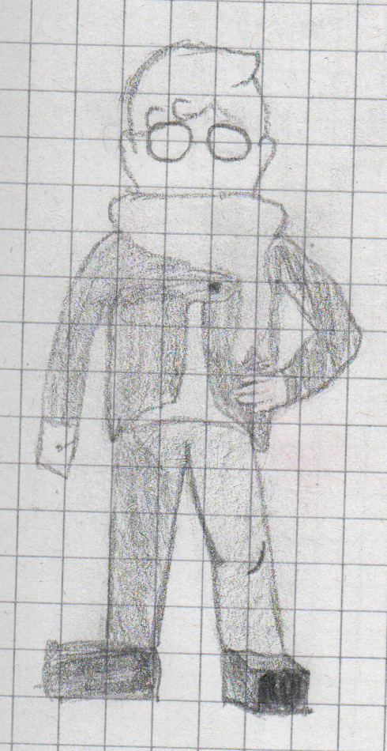

The Official Design Document

## ABOUT THE WORLD

###### The cities are connected by lore in a “triangular” way.

### Nyx
Italian city in which there is never the day, there is only night.

### Hypnos
Italo-American city where you can only see stars in the sky doesn't matter if it's day or night. Sub-city of Prima Luna born in the 20th July 1969, extremely famous for its free lunar trips

### Basileus
City founded by travellers and aristocrats in the 1900s, the inhabitants still wear classic aristocrat clothing: blue jacket and a white wig.

### Oneiros
Rebuilt Utopia after the 1962 earthquake

### Fantasia
City famous for its inventors. Utopia: Ancient city of travellers coming from various parts of the world. Historians believe it was founded at the start of humanity itself.

### Eimos
now-abandoned city founded by the cowboy named John in the 1856s.

### Tyche
this, now-abandoned, city was founded by John's brother, nicknamed “Doe", around the same timeframe as Atyche was. This place was known all around Evrys as “The Luckiest Place Ever”, however documentation that would explain the meaning behind this title, to this day, is still missing; Lots of the families that originally lived here were (after a catastrophe, which documentation about, is again, still missing to this day), subsequently moved to Ace

### Eirene
city founded by “the Prince” in 1834\. The peculiar name comes from the unique pyramidal rock formation that happens to be common there; divided in 4 sections.

##### Civil Zone I
On sea level, most of the shops in Sharplains reside here.

##### Civil Zone II
Above sea level,on a hill, decorated with trees and bushes.
##### Civil Zone III
located on a mountain, surrounded by a forest. Most of the houses there are built out of wood

### Xenos
City founded by pirates, flooded like Venice. Known for the Excellent Food.

### Philomela
Community founded by “the Prince” sometime after Sharplains. Not a real city, more like a camping spot.

### Kassandra
TO BE FILLED

### Drop
Almost nothing is currently known about this little island, except there being an extremely powerful source of energy coming from it. Scientists and Physicists from all Evrys are studying said source of energy and some applications for it.

## ABOUT THE EVENTS

###### This story is happening on a fictional island named “Evrys”, in the “[Bermuda Triangle](https://en.wikipedia.org/wiki/Bermuda_Triangle)”, also known as the “Devil's Triangle/Palm” or “Hurricane Alley”. It's Inspired on [Phillip Island.](https://en.wikipedia.org/wiki/Phillip_Island)

The year is 2006.
on a small island located in the bermuda triangle,

### Chapter 1 - Start

### Chapter 2 - Let's Begin

### Chapter 3 - The Five Tapes

### Chapter 4 - Illumination

### Chapter 5 - Burnt Soil

### Chapter 6 - Curtain Call

## ABOUT THE GAMEPLAY MECHANICS (MAY BE OUTDATED)

### Dealing Damage
When attacking, a damage object will be created to deal damage and knockback upon impact with the “lifeform” object.
Said damage will be determined through an algorithm:
a variable named “choosedmg” is created to output a whole number between a set range (from 0 to n, which is this case is 100).
the game will then check if that whole number is more/or less than 0/25, 25/85, 85/100.
if it is in the 0/25 range, the damage object will deal to the enemy, upon impact, a random amount of damage between 1 and 4
otherwise, if it is in the 25/85 range, the damage object will deal to the enemy, upon impact, a random amount of damage between 5 and 8
or else if it is in the 85/100 range, the damage object will deal to the enemy, upon impact, a random amount of damage between 18 and 25

### Attacking
When attacking the first 2 times, the player will move slightly towards the direction they’re facing when attacking.
The 3rd attack, instead, after giving a major boost of velocity towards the direction they’re facing, will let the player move freely, in exchange for speed. (e.g. spd=3)
Below: concept visualized.

### Combo Mode
When dealing damage to enemies the “K” factor bar will fill itself;
then, If K is equal to or more than 1, the player, through the skill menu, can use combo mode, reducing by 1 their current K, during this time, the movement speed is 2.35x
It should last 5 seconds.
all the moves hit instantly and have no build-up time.

### Response
If one were to press the attack button while the enemy is attacking them, they’d parry the attack. When parrying, the player is dealt by the system one fourth the damage, while the enemy gets 4x the damage they’d have dealt on the player.
When parrying, a shader will be applied, layering some sort of shining fx on top of the player sprite

### Auditory Stimuli
When in a battle, during certain time frames of the song that’s playing in the background, party members will get a slight boost, dealing 1.25x the damage; while on the background will be layered the same aforementioned moving light blue background but with a “wavy” effect (through shaders maybe?), to give a “feeling of the world around you warping”.

###### example song: [Orchestrating a Fight](https://soundcloud.com/lasthopeost/orchestrating-a-fight)
###### time frames: 0:26-0:56;

### Minigames

When in a battle, “a variable named choosedmg is created to output a whole number between a set range (from 0 to n, which is this case is 100). the game will then check if said whole number is in the 85/100 range, the damage object will deal to the enemy, upon impact, a random amount of damage between 18 and 25” apart from all that, additional damage can be dealt to the enemy, because, when “choosedmg” is >85 and <100, when attacking, the player will be able to play a sort-of minigame, which will decide how much additional damage they’ll be able to deal.
if the player fails at executing successfully the objective of the minigame, they will deal no additional damage at all, if they do, however, successfully acquire the objective, they will deal up to 2.5x the original damage (min = 45; max = 63 [62.5])

## Team Attack (may be scrapped)
When combo mode is activated, Party members, (except for the player, duh), will automatically execute team attacks, example:
Quinton throws a electrically-charged baseball and Charlie hits it, launching it towards the enemy, hitting the enemy will result in 15% The enemy’s current health to be dealt as damage.
If the player were to interfere with the team attack, the damage will instead amount to 25% of the enemy’s current health

## Transitions
battle transition: when colliding with an enemy, apply a shader that’s a mixture of twisting, pixelization and chromatic aberration.

## Threat Level and Reaction Behavior

## CONCEPT ART

Kevin: Nemesis, Apollo, Elpis
Quinton: Zeus, Metis, Hygieia
Charlie: Ares, Auxo, Hebe
Bella: Athena, Hephaestos, Lyssa

Overworld: Gaia
Dreams: Aether
Fights and Thanatos' Home: Erebus
Main antagonist from Phi to Dolus
Dolus becomes Thanatos when Nyx gives him power.
*Dolus represents Prometheus, he brings the cure to death, and gets punished for it.*
The Fool: Apollo, the god of prophecy.
The Magician: Theodon, god of reality and uncertainty.
The High Priestess: Harpocrates, god of secrets.
The Empress: Gaia, goddess
The Emperor: Cratus, god of strengh.
The Hierophant: Eleos, god of mercy
The Lovers: Eros, guess what he's the god of.
The Chariot: Nike, Goddes of Victory
Justice: Astraea: goddess of justice
The Hermit: Metis, for his clairvoyance
Wheel of Fortune: Tyche, goddess of fortune
Strength: Ares.
The Hanged Man: Prometheus, for his fate.
Death: Thanatos
Temperance: Hades, for his perseverance.
The Devil: Peitho, for her power to attract.
The Tower: Janus, goddess of change.
The Star: Elpis, to signify Hope
The Moon: Pharkys, for the underlying Threats
The Sun: Euphrasyne, to sygnify happiness.
Judgement: Caerus, god of second chances
The World: Nemesis, for it gives back what has been earned.
Hygeia, for health.
Hephaestos, the god of flames.
Lyssa, the goddess of rage.
Athena, the scheming goddess.
Auxo, The goddess of growth.
Hebe, The goddess of youngness
Zeus, god of thunder

 © 2020 Davide Azzaretto/envyniv
