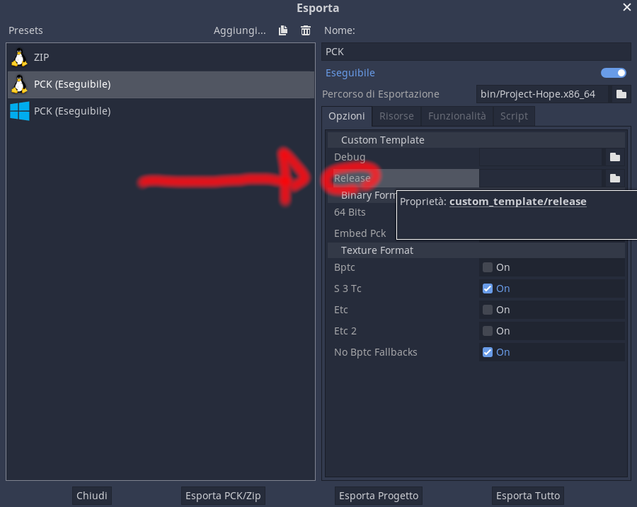

--------------------------------------------------------------------------------

_My take on an RPG._

[Website](https://envyniv.github.io/Project-Hope)

> Coded in [Godot](https://godotengine.org/).

> Font used is PX Sans by [teryor](https://github.com/teryror/pixel-fonts)

> Camera2D ScreenShake effect based on [eyeEmotion](https://godotengine.org/qa/user/eyeEmotion)'s script

> Logo(s) by [Davide Azzaretto/envyniv](https://github.com/envyniv)

Davide Azzaretto/envyniv, 2020.

# Twirl Pixel Members

- envyniv; (Code, Art, Writing, Lead, etc.)
- David Kvistorf (davidkvis99); (Music, Writing)

# Footage

<!-- [](https://www.youtube.com/watch?v=2yaVttZoP04 "Early Indev") -->

 # TODO

- [ ] Allow party composition changes
- [ ] _Player.gd_, fix movement functions so that moveSpeed doesn't always have to be specified
- [ ] _Party members_, fix jittering ([potentially related to normalized vectors](https://youtu.be/fZ6bOERw03M?t=123)), replace `snakeTail` & `follower` with a more correct, signal based system
- [ ] _Minigames_, implement
- [ ] _DiagBox.gd_, make it so punctuation slows down text flow
- [ ] _Skills_, implement
- [ ] _ModManager_, figure out why the =!%$ it loads stuff into itemDB
- [ ] _DiagBox.gd_, implement emitting signals following LE-Diag specs <!-- - [ ] maybe merge dialogue .json and localization csv? -->
- [ ] _DiagBox.gd_, reimplement choices, since they don't work properly.
- [ ] _Pause Menu_, clean up and finish
- [X] _File Menu_, 3 saves
- [X] Custom Splashscreen
- [X] _Viewports_, replace `inbattle`, `inshop`, `indialog` with signals
- [X] _Trailing Party Members/PlayerFollower.gd_, fix always playing walk anim
- [X] _FileMan_, offload all filechecks and loads to it
- [X] _SaveFile.gd_, move to Godot Resource (.res)
- [X] _Controls_, make reboundable
- [X] _Controls_, fix scene
- [X] _Settings_, allow a bunch of customization options (Volume, Text spd, video scaling)
- [X] _Settings_, make percentage labels follow slider puck
- [X] _Player_, split code in AwareBase, PlayerFollower, Player
- [X] _SaveFile_, add previews

--------------------------------------------------------------------------------

# Export Game/Build Custom Templates

## Exporting the Game



After having acquired your custom templates (preferrably from the following steps), in the export screen, go to the Settings tab, and add the exec to `Release`

_Please Note: if you plan on editing the export presets, I would suggest you do so through a text editor, or you may meet graphical glitches/incomprehensible characters in the editor_

_Please Note 2: As obvious as it may sound, this has to be stated; PCKs and ZIPs exported from Linux WILL work on Windows, however the opposite is not true._

## Compiling The Templates

### Linux

- download the godot 3.2.3-stable source code from [here](https://github.com/godotengine/godot/archive/3.2.3-stable.zip)

- download `custom.py` from [here](https://github.com/envyniv/Project-Hope/raw/master/customtemplates/custom.py)

- put custom.py in the godot source code folder

- [make sure you've got compiling dependencies installed](https://docs.godotengine.org/en/stable/development/compiling/compiling_for_x11.html)

- - Optional: [Cross compiling for Windows](https://docs.godotengine.org/en/stable/development/compiling/compiling_for_windows.html#cross-compiling-for-windows-from-other-operating-systems) (if not desired omit first two lines of the following `code block`)

- - Optional: [Cross compiling for macOS](https://docs.godotengine.org/en/stable/development/compiling/compiling_for_osx.html#cross-compiling-for-macos-from-linux) (not officially supported by me)

- Execute the following commands:

  ```
  scons platform=windows target=release bits=64
  strip bin/godot.windows.opt.64.exe
  scons platform=x11 target=release bits=64
  strip bin/godot.x11.opt.64
  upx -9 bin/godot.windows.opt.64.exe
  upx -9 bin/godot.x11.opt.64
  ```

# Special Thanks

- Everyone in [my discord server](https://discord.gg/bNkDkHW) for being supportive
- You (for acknowledging this game)
- Gzillion/Newbie (minor sprite work)
- Aléris (minor sprite work)
- gotimo2 (separated player movement and animation)
- Everyone from the [Godot Engine discord server](https://discord.gg/4JBkykG) for being a bunch of awesome peeps!

--------------------------------------------------------------------------------

# About the game

A collection of all .md files in the game's source folders, that i reunited in this section, for convinience.

--------------------------------------------------------------------------------

# Contact

Wanna ask me something? send an email to envy67@pm.me
