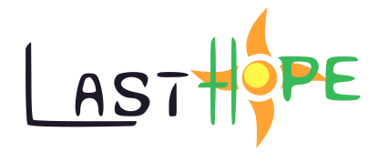

_Run of the mill RPG with a somewhat unique battle system, where the main villain tries to blow up the sun with radiation._

> Developed in [Godot](https://godotengine.org/) with [MinDiagEdit](https://github.com/envyniv/mindiagedit);

> fonts used include
	- [PX Sans](https://github.com/teryror/pixel-fonts).
	
> Logo(s) by [envyniv](https://github.com/envyniv), OST BGM by [Fluffclipse](https://soundcloud.com/fluffclipse)

---

# [TODO](https://todo.cesare.cfd/public/board/974cd3d3f3334e1e5b749b4751672299b8e6a5bd42461c857c8c84d5a393)

---

# Special Thanks

- Everyone in [my discord server](https://discord.gg/bNkDkHW) for being
  supportive
- You
- Gzillion/Newbie, Aléris, and gotimo2 for helping in the early days of the project
- Everyone from the [Godot Engine discord server](https://discord.gg/4JBkykG) for aiding newbies like myself
