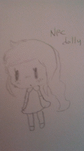
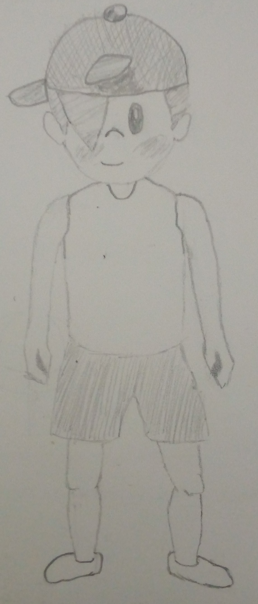
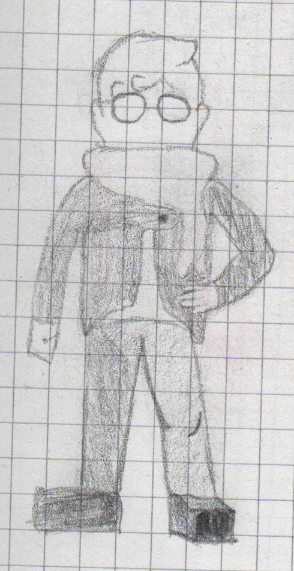
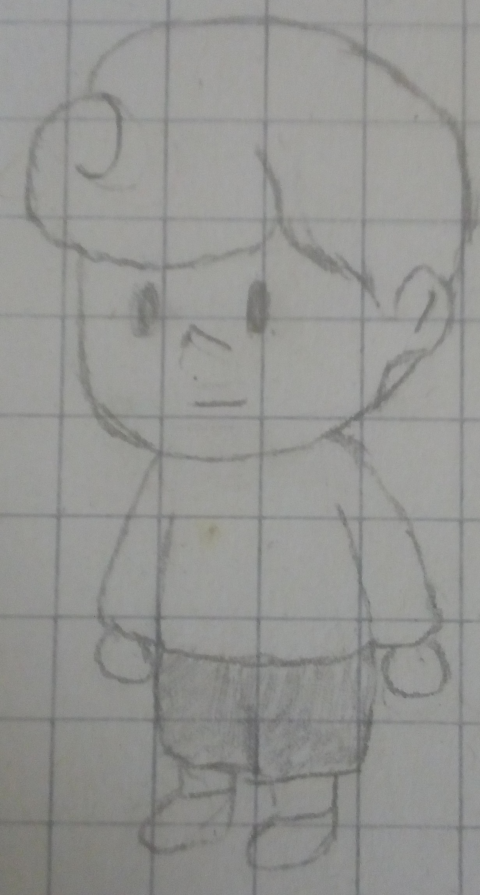
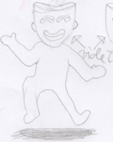
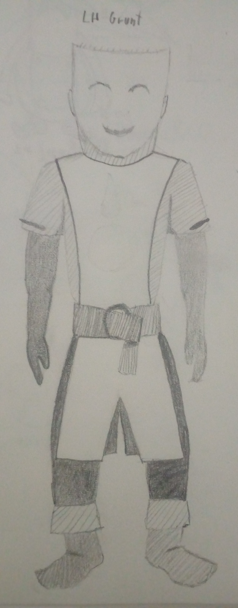
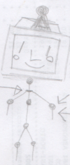
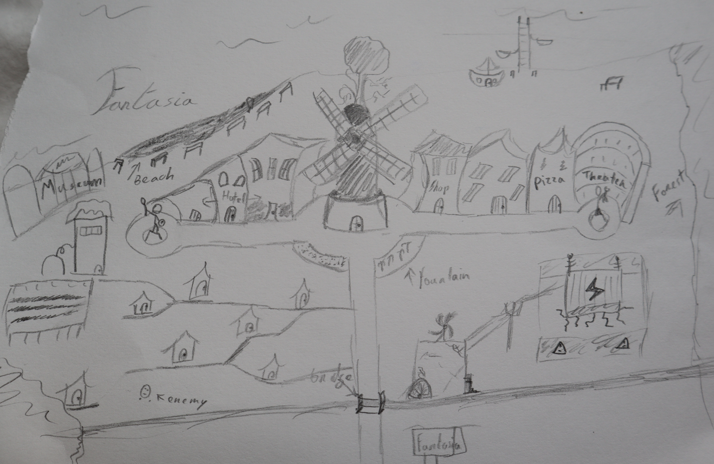
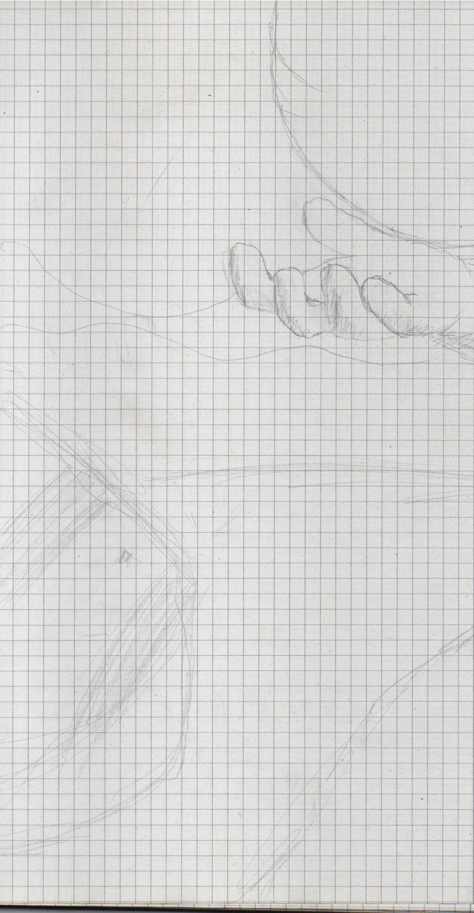
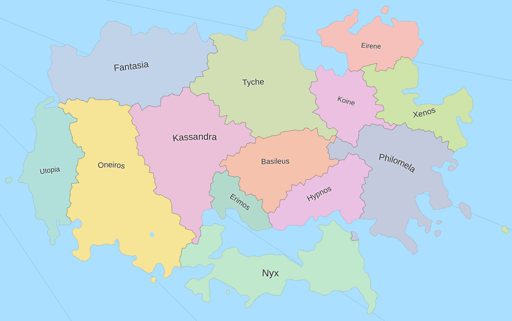

--------------------------------------------------------------------------------

_SUNBURST - Run of the mill RPG with a somewhat unique battle system._

[Website](https://envyniv.github.io/Project-Hope)

--------------------------------------------------------------------------------

# About the Game

## Plot Synopsis

The game takes place on a fictional island in the Bermuda Triangle, named Evrys (Temporary)

Evrys is fractured in 10 cities: Nyx, Utopia, Basileus, Oneiros, Fantasia, Erimos, Tyche, Eirene, Xenos and Philomela.

You start off in Utopia, in the protagonist's bedroom, witnessing the awakening of the protagonist, Kevin.

He goes to Oneiros for some errands, and meets the Villainous clan featured throughout the whole game, The Actors.

## Compendium

A Collection of all Concept Art made for the game, and related descriptions.

### The Main Cast

#### Sarah

My Friend Noel had drawn some designs for LH and shared them on my discord server, This was amongst the ones chosen.

#### Charlie

 

Kid that likes tinkering and baseball.

#### Quinton

The introvert.

#### Kevin

The "..." guy.

### Enemies

#### Main Villain

The main villain of the game; Leader of The Actors. Name and origins unknown.

#### Actor Grunt

Low rank grunts, medieval clothing.

#### ADOS

Scrapped main villain. Sentient AI.

#### PSA-rachnid and Raggey Rancid

My Friend Noel had drawn some designs for LH and PSArachnid was chosen, leaving Raggey Rancid with no representation.

An Abandoned TV, now a home of a specimen of the Great Longleg spider spieces, native to the Evrys island.

### Locations

#### Fantasia

Fantasia.

### Skills

#### SunBurst

Fire-Electric Skill. Feel the Sun's Surface bursting and zapping.

#### SuperNova

Light Skill. The power of a dying star.

#### BlackHole

Dark Skill. Immense gravity in an immensely tiny black spot.

#### WormHole

### Items

### Misc

Early Title Screen BG draft; was supposed to have the Main Villain's hand holding the sun, and Kevin staring from the spot marked on the hill

 

Scrapped Logos for the game.

Map generated with the use of some website, Basis for in-game one.

--------------------------------------------------------------------------------

# Footage

# Special Thanks

- Everyone in [my discord server](https://discord.gg/bNkDkHW) for being supportive
- You (you're awesome :sunglasses:)
- Gzillion/Newbie, Aléris (minor sprite work)
- gotimo2 (separated player movement and animation)
- Everyone from the [Godot Engine discord server](https://discord.gg/4JBkykG) for being cool

--------------------------------------------------------------------------------

# Contact

Wanna ask me something? send an email to envy67@pm.me
